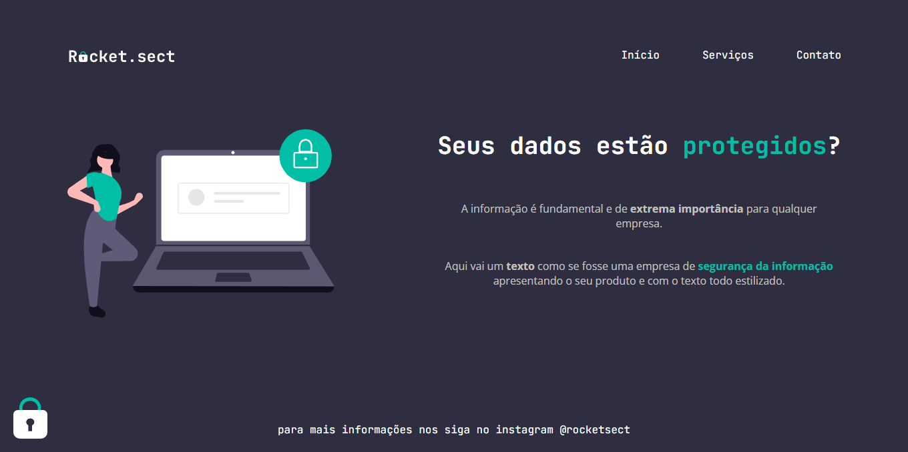

<h1 align="center">Projeto: Rocket Sect
</h1>

Desafio 03 - Rocket Sect

  <a href="#-tecnologias">Tecnologias</a>&nbsp;&nbsp;&nbsp;|&nbsp;&nbsp;&nbsp;
  <a href="#-projeto">Projeto</a>&nbsp;&nbsp;&nbsp;|&nbsp;&nbsp;&nbsp;
  <a href="#-como-executar">Como executar</a>&nbsp;&nbsp;&nbsp;|&nbsp;&nbsp;&nbsp;
  <a href="#memo-licença">Licença</a>

  

 

  

## 🚀 Tecnologias

Esse projeto foi desenvolvido com as seguintes tecnologias:

- HTML e CSS

## 💻 Projeto

Rocket Sect é uma página web projetada para uma empresa de segurança da informação. A página destaca a importância da proteção de dados e apresenta os serviços oferecidos pela empresa.

#### Fontes e Cores
As fontes utilizadas são fornecidas pelo Google Fonts:

* JetBrains Mono
* Open Sans

Cores:

#### Cores utilizadas:

* #2F2E41
* #00BFA6
* #C2C2C2
* #FFFFFF

## 🔖 Como executar

Clone o repositório para o seu ambiente local.

Abra o arquivo index.html no seu navegador preferido.

## :memo: Licença

Esse projeto está sob a licença MIT.